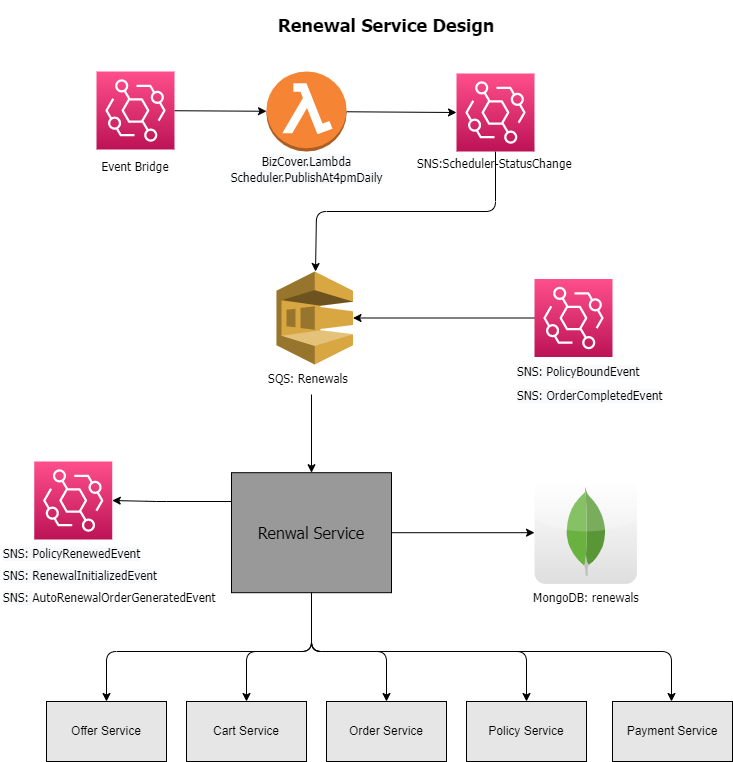
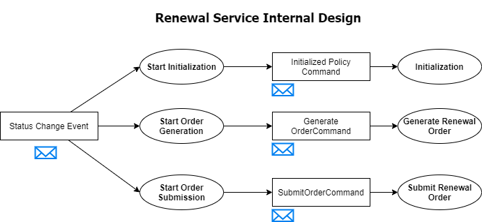
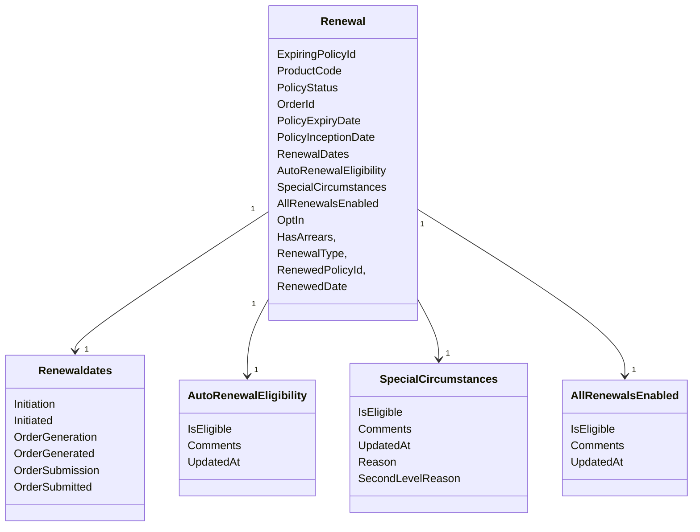

# BizCover.Api.Renewals

Renewal Service is responsible for renewing expiring policy. 

### Renewal Service Use cases
- **Add or Update Policy Renewal Details:** When we bind the policy we also add/update policy into renewal database with renewal details
- **Initiate Renewal:** The policy renewal process in initiated 40* days prior to policy expiry date.
- **Auto Renewal Order Generation:** Draft Auto renewal order is generated for policies 21* prior to expiry date.
- **Auto Renewal Order Submission:** Auto renewal order is submitted 7* days prior to expiry date.
- **Generate Renewal Order:** If Renewal eligibility criteria are met, Renewal order is generated for specific policy.
- **Submit Renewal Order:** If Renewal eligibility criteria are met, Renewal order is submitted for specific policy.
- **Set Policy As Renewed:** Consumes OrderCompletedEvent and RenewedPolicyId is recorded against the expiring policy.
- **Update Auto Renewal Opt-in flag:** Update auto renewal opt in flag
- **Update Auto Renewal Eligibility:** Update auto renewal eligibility for particular policy
- **Update Auto Renewal Enable All Renewals:** Update all renewal enable flag
- **Update Special Circumstances:** Update policy special circumstances flag
- **Get Renewal Detail:** Return renewal detail by PolicyId

**Days are configured at product level**

<hr/>
<p align="center">
  
</p>
<hr/>

<hr/>
<p align="center">
  
</p>
<hr/>

### Renewal Entity


## Component tests 

### Set nuget credentials
Ensure GH_PKGS_TOKEN and use GH_USER are in the host environment 
```
EXPORT GH_USER=username_here
EXPORT GH_PKGS_TOKEN=ghp_XYZ
```
Use `SET` instead of `EXPORT` if not available ( for Linux use export)
You can set these permanently via SETX ( or bashrc)

### Run component tests infrastructure
```
docker-compose -f docker-compose-component.yml up     
```
remember  "-d" for dettach/ background --build  to force a rebuild 
If your running detached wait the run the following (or run in another window )

### Run the component tests
```
dotnet test  tests/tests\BizCover.Api.Renewals.ComponentTests
```
Can also run from visual studio. 
